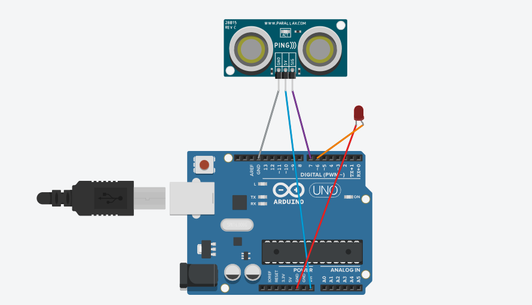

# *Sensor de monitoramento de energia*

## Ideia

  Sistema inteligente de iluminação para ambientes. Possibilitando ligar ou desligar a iluminação do ambiente, através de interface web.
	O sistema identifica por sensor a presença de indivíduos no ambiente, desligando automaticamente a iluminação do ambiente após um intervalo de tempo.

## Montagem do dispositivo

## Código Fonte

<a href="https://github.com/felipefoliveira1/objint-projeto-05J12/blob/master/docs/Codigo_Fonte.txt">Código Fonte</a>
